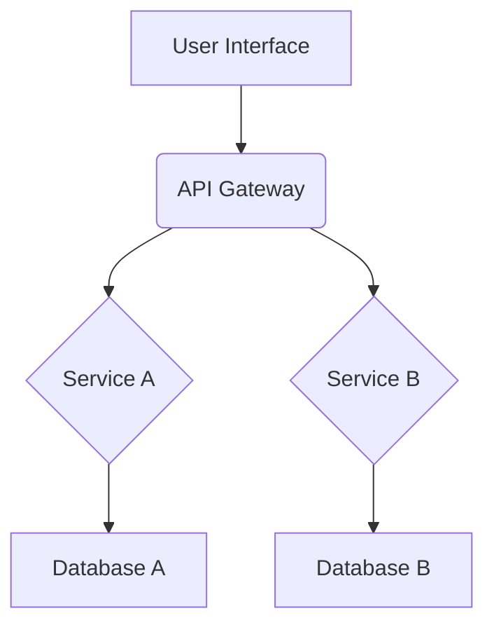

# System Patterns

## 1. System Architecture Overview
*(Provide a high-level description of the system's architecture. Is it monolithic, microservices, event-driven, layered, etc.? Include a simple diagram if helpful, e.g., using Mermaid syntax.)*

### Example Mermaid Diagram:

## 2. Key Technical Decisions & Rationale
*(Document significant architectural or technical decisions made. For each decision, explain the problem it solved, the options considered, and the reason for the chosen solution. Reference ADRs if they exist.)*
    - **Decision 1:** [e.g., Choice of primary database]
        - **Rationale:** ...
    - **Decision 2:** [e.g., Messaging queue selection]
        - **Rationale:** ...

## 3. Core Design Patterns in Use
*(List and briefly describe the major design patterns employed throughout the system, e.g., Repository, Factory, Observer, Singleton, CQRS. Explain where and why they are used.)*
    - **Pattern 1:** [e.g., Repository Pattern]
        - **Usage:** [e.g., Data access layers for all major entities]
    - **Pattern 2:** [e.g., Event Sourcing]
        - **Usage:** [e.g., For tracking changes to critical domain objects]

## 4. Component Relationships & Interactions
*(Describe how the main components or services of the system interact with each other. What are the key interfaces and communication protocols?)*

## 5. Critical Implementation Paths & Workflows
*(Identify and describe any particularly complex or critical workflows or data flows within the system. This helps in understanding potential bottlenecks or areas requiring special attention.)*
